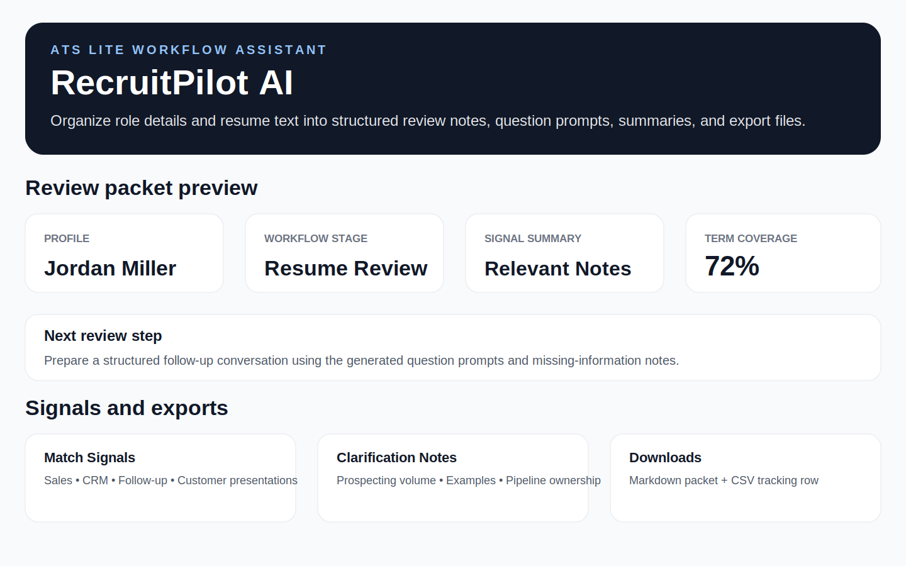

# RecruitPilot AI

RecruitPilot AI is a responsible, AI-enhanced ATS Lite resume review assistant for small-business and field-sales teams.

It helps hiring managers organize job descriptions and resume information into:

- Candidate pipeline stage
- Resume review priority
- Resume match signals
- Job-term coverage
- Missing or unclear information
- AI-enhanced follow-up interview questions with rules-based fallback
- AI-enhanced manager-ready review summaries with rules-based fallback
- AI-enhanced candidate follow-up emails with rules-based fallback
- Downloadable resume review packets

RecruitPilot AI is designed to support human review. It should not be used as the sole basis for selection, rejection, compensation, or employment decisions.

## Live Demo

[Launch RecruitPilot AI](https://recruitpilot-ai.streamlit.app/)

## Current Version: v2.3

RecruitPilot AI combines a rules-based applicant review organizer with embedded AI-enhanced interview preparation support.

The app is designed to work in two layers:

1. **Rules-based core:** extracts job-related terms, identifies resume match signals, highlights missing or unclear information, and creates a structured human-review packet.
2. **Embedded AI layer:** when an OpenAI token is available, the app quietly improves the manager summary, follow-up questions, and candidate email while preserving responsible-use guardrails.

If the AI call fails or an API key is unavailable, the app silently falls back to the rules-based review packet. The user experience stays the same.

## Responsible Use

RecruitPilot AI does not make hiring decisions, reject candidates, rank candidates, or replace human judgment.

The app is intended to organize information and prepare a structured review packet for a human hiring manager.

It should not be used as the sole basis for:

- Selection decisions
- Rejection decisions
- Compensation decisions
- Employment eligibility decisions
- Final hiring recommendations

## Why this project exists

Small and mid-sized businesses often review applicants from scattered notes, pasted resumes, job descriptions, and informal conversations. RecruitPilot AI helps organize applicant information into a cleaner review packet so hiring managers can prepare better questions and document next steps more consistently.

## Workflow Outputs

- Job description input
- Resume text input
- Optional `.txt` / `.md` resume upload
- Candidate pipeline stage tracking
- Role type selector
- Resume match signal extraction
- Job-term coverage calculation
- Missing or unclear information checklist
- Review priority labels
- Next human review step
- AI-enhanced follow-up interview questions with rules-based fallback
- AI-enhanced manager-ready review summary with rules-based fallback
- AI-enhanced candidate follow-up email with rules-based fallback
- Downloadable Markdown resume review packet
- Candidate tracker CSV row export

## Export Strategy

Current exports:

- Markdown resume review packet (`.md`) for GitHub-friendly and developer-friendly documentation
- Candidate tracker CSV row for applicant tracking workflows

Planned next upgrade:

- PDF resume review packet for a more user-friendly hiring manager deliverable

The markdown export is useful for transparency and version control, but PDF is the better format for non-technical users.

## Suggested Test Flow

1. Launch the live demo.
2. Load the “Field Sales Resume Review” sample scenario.
3. Generate the resume review packet.
4. Review the pipeline stage, review priority, match signals, and job-term coverage.
5. Review missing or unclear information and AI-enhanced follow-up interview questions.
6. Review the manager summary and candidate email.
7. Download the resume review packet and candidate tracker CSV row.
8. Optionally test the `.txt` or `.md` resume upload workflow.

## Screenshots

### Review Workflow and Export Preview



## Tech Stack

- Python
- Streamlit
- OpenAI API integration
- Responsible AI workflow design
- Rules-based review organization
- Silent AI fallback pattern
- Keyword and signal extraction
- Markdown report export
- CSV export
- GitHub
- Streamlit Community Cloud

## Run Locally

```bash
py -m pip install -r requirements.txt
py -m streamlit run app.py
```

## Environment Variables

To enable embedded AI output:

```bash
OPENAI_TOKEN=your_api_key_here
```

The app still works without this token by using the rules-based fallback.

## Public Demo Note

All sample data, names, companies, and scenarios used in this project are fictional and created for public portfolio demonstration purposes.

## Case Study

### Problem

Small and mid-sized businesses often review applicants using scattered notes, resumes, job descriptions, and informal interview impressions. This can make it difficult to identify relevant resume signals, spot missing information, prepare follow-up questions, and document the review process consistently.

### Solution

RecruitPilot AI organizes job descriptions and resume text into a structured review packet that supports human review. The embedded AI layer improves interview preparation, manager summaries, and candidate communication while preserving strict responsible-use boundaries.

### Business Value

RecruitPilot AI helps small and mid-sized businesses organize applicant review more consistently without replacing human judgment.

## Built By

Bradley Hankins  
Operations & Revenue Leader | AI Workflow Automation | RevOps & Process Improvement
