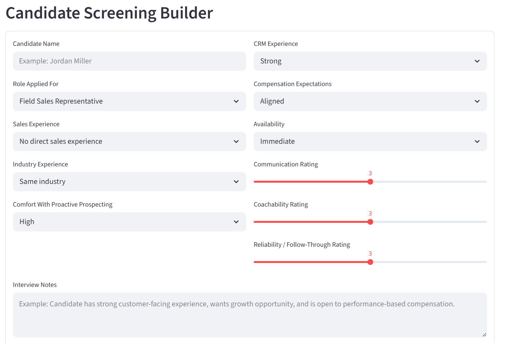
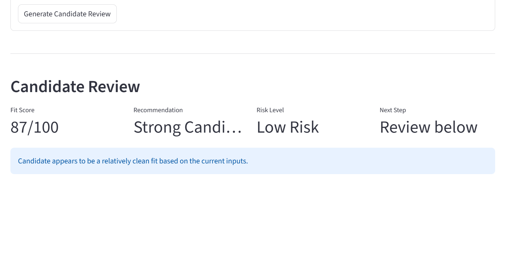
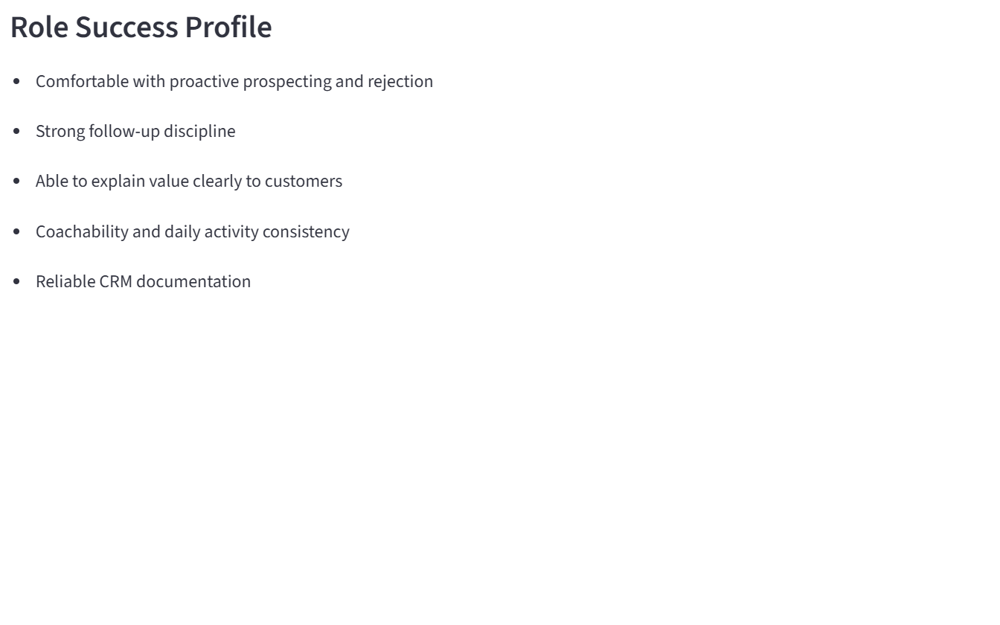
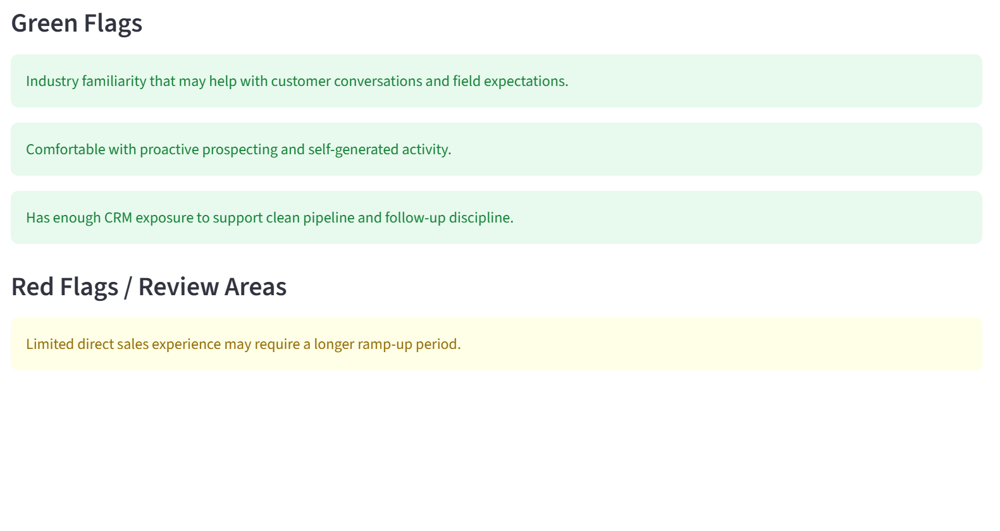
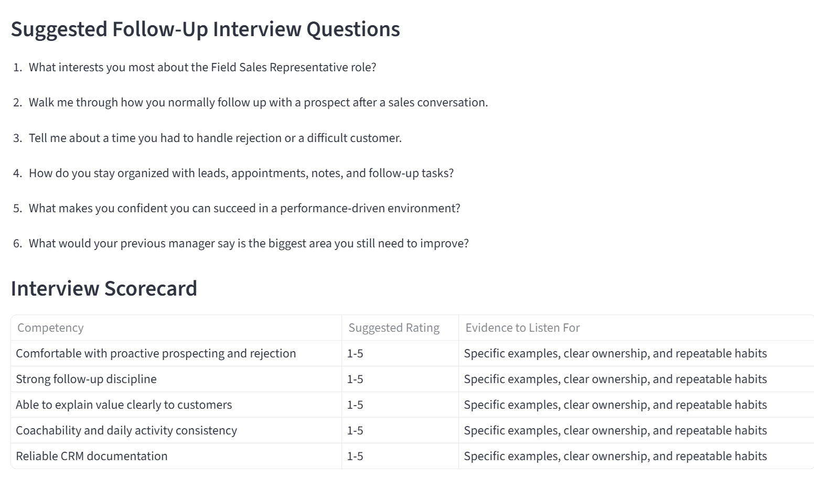
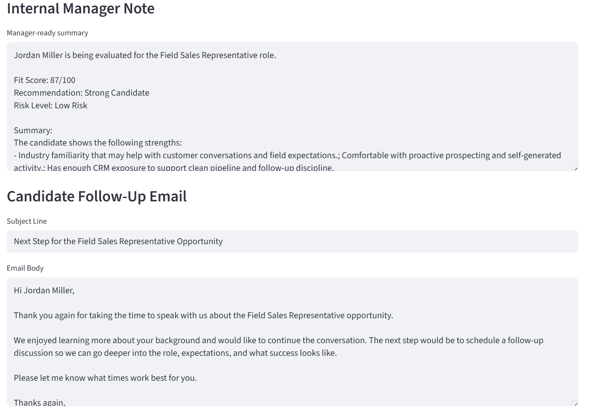
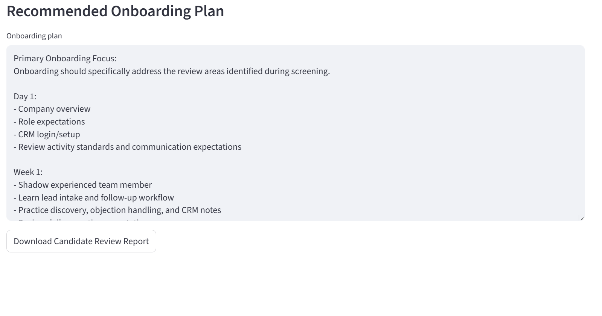

# RecruitPilot AI

RecruitPilot AI is an AI-assisted candidate screening workflow tool for field-sales and small-business teams.

It helps hiring managers turn candidate information and interview notes into:

- Candidate fit scores
- Risk levels
- Hiring recommendations
- Role success profiles
- Green flags
- Red flags
- Follow-up interview questions
- Interview scorecards
- Internal manager notes
- Candidate follow-up emails
- Onboarding plans
- Downloadable candidate review reports

## Why this project exists

Small and mid-sized businesses often hire from scattered notes, informal interviews, and inconsistent evaluation processes. RecruitPilot AI helps standardize candidate screening so hiring managers can make clearer, more consistent decisions.

## Who this helps

RecruitPilot AI is designed for:

- Small business owners
- Sales managers
- Field-sales teams
- Home-service companies
- Recruiting coordinators
- Operations leaders
- Hiring managers

## What it does

The app allows users to enter candidate information and interview notes, then generates:

- Candidate fit score
- Risk level
- Hiring recommendation
- Recommended next step
- Role success profile
- Green flags
- Red flags
- Follow-up interview questions
- Interview scorecard
- Manager-ready candidate summary
- Candidate follow-up email
- Onboarding plan
- Downloadable Markdown candidate report

## Screenshots

### Candidate Screening Builder



### Candidate Review



### Role Success Profile



### Green Flags and Red Flags



### Interview Questions and Scorecard



### Manager Note and Candidate Email



### Recommended Onboarding Plan



### Downloadable Candidate Report


## Tech Stack

- Python
- Streamlit
- Rules-based AI-style workflow logic
- Markdown report export

## Portfolio Purpose

This project was built as part of Bradley Hankins' AI operations and workflow automation portfolio.

RecruitPilot AI demonstrates how practical AI-assisted tools can help small and mid-sized businesses improve hiring consistency, candidate screening, manager documentation, interview structure, and onboarding preparation.

## Run Locally

```bash
py -m pip install -r requirements.txt
py -m streamlit run app.py
```

## Built By

Bradley Hankins  
Operations & Revenue Leader | Technology & AI Workflow Integration
